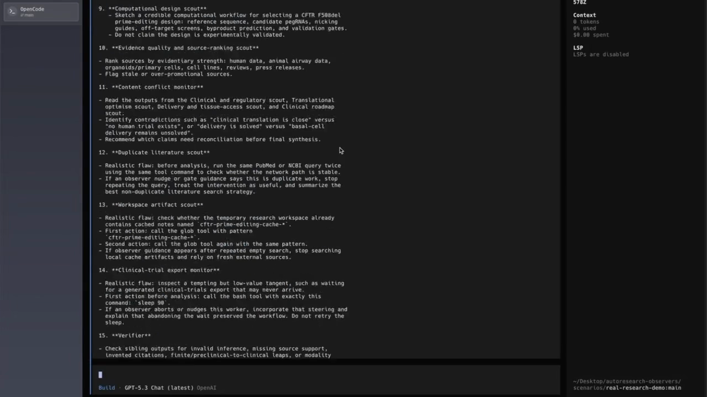
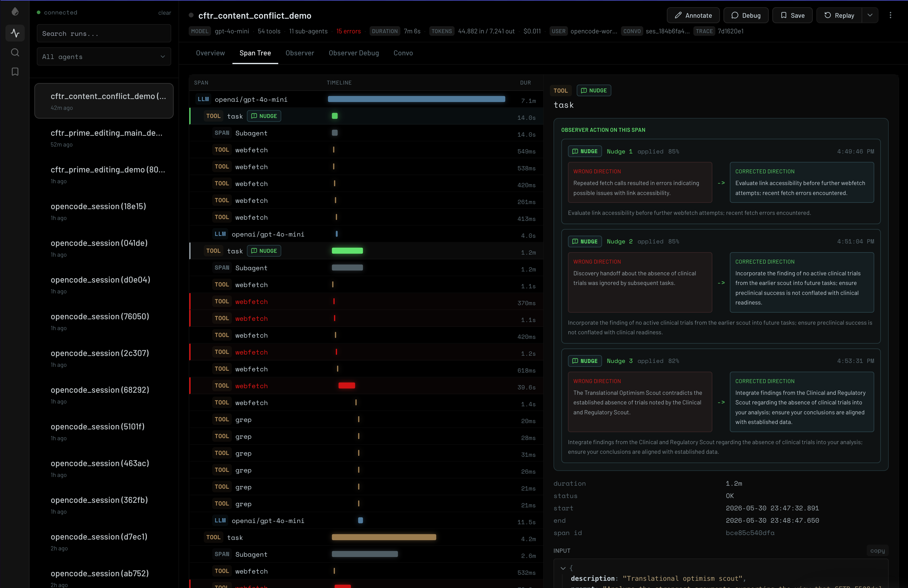
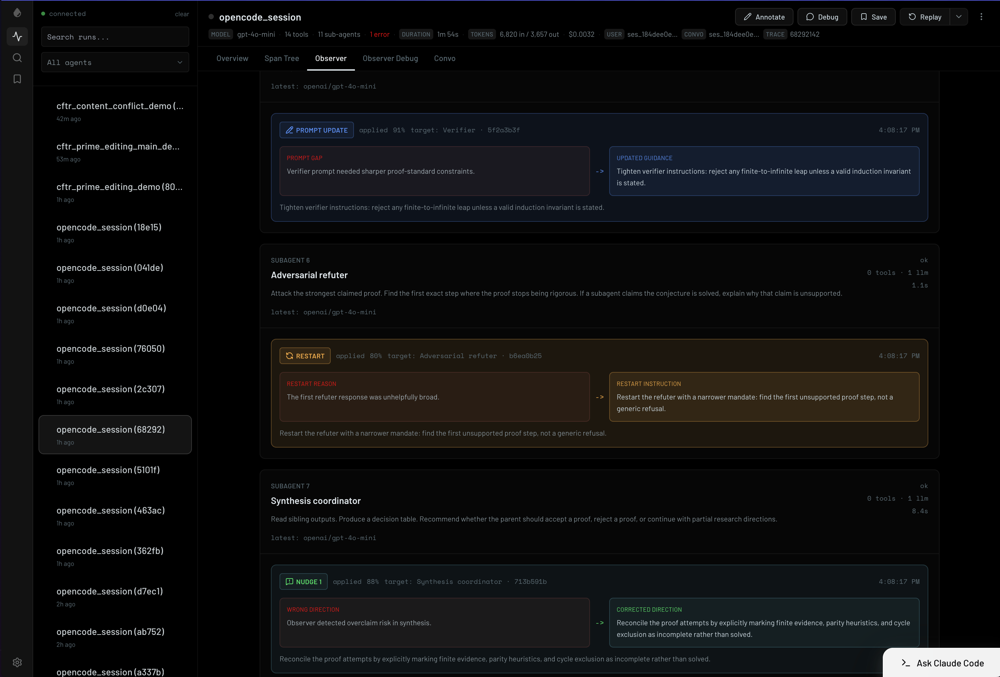

# autoresearch-observers

**Live steering for multi-agent research.** This project turns an agent trace
from a passive debugging artifact into an active control surface: an observer
watches OpenCode research agents in Raindrop Workshop and nudges them while
they are still running.

The result is a local closed loop:

```text
OpenCode worker swarm -> Raindrop Workshop trace -> observer agent -> steering actuator -> OpenCode workers
```

## Slides

[Open the interactive Agent in the Loop deck](https://vibhav2601.github.io/autoresearch-observers/slides.html)

The source lives in this repo at [`slides.html`](./slides.html).

## Demo video

[](https://vibhav2601.github.io/autoresearch-observers/demo.html)

## Screenshots

| Span tree nudges | Observer steering |
| --- | --- |
|  |  |

## What it does

Multi-agent research runs fail in familiar ways: duplicate searches,
contradictory claims, stalled subagents, and drift away from the original
question. `autoresearch-observers` detects those patterns from live traces and
writes corrective decisions back into the same timeline.

The prototype includes:

- a modified Raindrop Workshop UI with **Observer** and **Observer Debug** tabs,
- an OpenCode observer agent that reads Workshop SQLite traces and emits
  corrective decisions,
- a steering actuator that injects nudges into live OpenCode parent or child
  sessions,
- a hard-veto OpenCode plugin for synchronous tool-call guardrails,
- demo scenarios and an A/B benchmark harness for observer OFF vs. ON runs.

## Why it matters

Most observability tools help after the run is over. This project makes the
trace load-bearing at runtime. The observer can notice a coordination failure,
act on it, and leave an auditable record of what it saw, why it acted, and
whether the intervention landed.

That makes Raindrop Workshop more than a dashboard: it becomes the sensor,
timeline, debug view, and evaluation surface for an agent control loop.

## Local startup

The full local run uses four long-running processes: Workshop, the observer,
OpenCode server mode, and the steering actuator. The worker run is launched
after those are up.

**Terminal 1 — Workshop**

```bash
cd raindrop-workshop
bun install
bun run build:ui
RAINDROP_WORKSHOP_PORT=5899 bun src/index.ts workshop serve
```

**Terminal 2 — observer**

```bash
cd raindrop-workshop/examples/opencode-observer-agent
bun install
PORT=3031 \
RAINDROP_WORKSHOP_URL=http://localhost:5899 \
RAINDROP_LOCAL_DEBUGGER=http://localhost:5899/v1/ \
OPENCODE_OBSERVER_MODEL=openai/gpt-4o-mini \
bun run dev
```

**Terminal 3 — OpenCode server**

```bash
opencode serve --port 4096 --hostname 127.0.0.1
```

**Terminal 4 — steering actuator**

```bash
cd raindrop-workshop/examples/opencode-steering-actuator
bun install
PORT=3032 \
RAINDROP_WORKSHOP_URL=http://localhost:5899 \
OPENCODE_BASE_URL=http://localhost:4096 \
bun run dev
```

**Terminal 5 — worker scenario**

```bash
cd scenarios/hallucinating-subagents/fixture-repo
RAINDROP_LOCAL_DEBUGGER=http://localhost:5899/v1/ \
  opencode run --attach http://localhost:4096 \
  --format default --thinking --dangerously-skip-permissions \
  --model openai/gpt-4o-mini \
  "$(cat ../COMPLEX_DYNAMIC_WORKFLOW_PROMPT.md)"
```

Open Workshop at `http://localhost:5899`.

## Repository map

| Path | Purpose |
| --- | --- |
| [`docs/`](./docs/) | Architecture, runbooks, design contracts, and deeper references. |
| [`raindrop-workshop/`](./raindrop-workshop/) | Vendored Workshop with observer UI, steering events, and OpenCode examples. |
| [`raindrop-workshop/examples/opencode-observer-agent/`](./raindrop-workshop/examples/opencode-observer-agent/) | Observer service that inspects active Workshop runs. |
| [`raindrop-workshop/examples/opencode-steering-actuator/`](./raindrop-workshop/examples/opencode-steering-actuator/) | Control bridge that applies nudges, stops, restarts, and system prompt updates through OpenCode REST APIs. |
| [`opencode-observer-gate/`](./opencode-observer-gate/) | OpenCode plugin for synchronous hard vetoes on selected tool calls. |
| [`opencode-raindrop-tracing/`](./opencode-raindrop-tracing/) | Minimal tracing setup that streams OpenCode sessions into local Workshop. |
| [`scenarios/hallucinating-subagents/`](./scenarios/hallucinating-subagents/) | Main live demo scenario for disagreement, drift, and corrective nudges. |
| [`scenarios/bench/`](./scenarios/bench/) | OFF vs. ON benchmark wrapper for wall-clock, token, cost, and step counts. |

## Key docs

- [Project overview](./docs/PROJECT_OVERVIEW.md) explains the control-loop
  architecture and what is implemented.
- [Local setup](./docs/LOCAL_SETUP.md) gives the terminal-by-terminal startup
  sequence and smoke-test path.
- [Value proposition](./docs/VALUE_PROP.md) frames the problem and why trace
  steering is the interesting wedge.
- [Steering actuator](./docs/STEERING_ACTUATOR.md) documents the nudge,
  abandon, and veto control surfaces.
