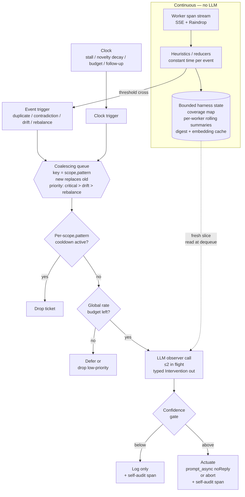

# Observer Harness — context-management plan

The observer agent in this project is an LLM. LLMs handle one input at a time and degrade as the
input grows. The harness around the observer exists to keep that input small, fresh, and scoped —
even when the worker swarm it watches is a firehose. This document is the design contract for that
harness.

Read [`PROJECT_OVERVIEW.md`](PROJECT_OVERVIEW.md) first for the closed-loop framing, the four
patterns the observer detects, and the four nudges it emits. This doc starts where that one stops:
**how do we feed the LLM observer without overwhelming it.**

---

## The principle

The observer's LLM should never see the raw span firehose. The harness maintains compact state;
the LLM is a function over that state, called only at decision points with a narrow slice. If the
LLM is reading span streams, the design has already failed.

---

## Context-hygiene principles

1. **Compress at ingest.** Each span distills immediately to a fixed-size record: worker_id,
   intent, action_key, embedding, novelty score, extracted claims/sources, duration. Full payload
   stays in Raindrop. Observer working memory holds digests only.

2. **State, not log.** The LLM sees the coverage map, per-worker rolling summaries (bounded
   tokens each), and the feature vector that tripped the heuristic. Not "here are the last 200
   spans." Carrying history is the harness's job.

3. **Pattern-scoped context.** Each of the four patterns implies its own projection. Duplicate
   work fires? Send the two suspect workers' search digests plus their cosine similarity, nothing
   else. Drift? Assigned subquestion plus recent activity. The heuristic already computed the
   features that justified waking the LLM. Pass those, not the inputs that produced them.

4. **Coverage map as long-term memory.** Anything worth carrying across decisions gets promoted
   onto the map. Span digests age out of the sliding window; the map persists. Most LLM calls
   operate on map plus a small delta.

5. **Project tool outputs at the boundary.** Web fetches and file reads are the worst firehose
   offenders. Harness extracts (claims, sources, query, novelty count) at ingest, discards raw
   text from observer state. Workshop still has the full payload for the timeline; observer
   working memory doesn't.

6. **Decisions are stateless-ish.** Each LLM call is scoped to one pattern firing with bounded
   inputs and a typed `Intervention` output. Not a running dialogue, not a memory-bearing thread.
   The harness carries continuity. The LLM is invoked fresh with the slice that matters.

7. **De-dupe at the digest layer.** N similar spans collapse to one canonical record with count
   plus exemplars. Embeddings drive similarity, not raw strings.

8. **Self-audit spans don't re-enter context.** Observer decisions go to Raindrop for the
   timeline and audit trail. They shouldn't feed back into observer prompts unless a heuristic
   explicitly demands it ("you've nudged worker 3 four times, escalate"), in which case pass the
   count, not the prior text.

9. **Bound everything.** Per-prompt token ceiling. Per-worker digest size. Sliding window
   length. LLM call rate limit. When budgets exceed, the harness drops oldest. The LLM never
   decides what to forget.

The shape this produces: a streaming aggregation layer with an LLM query function attached, not
an agent loop with a context window. Heuristics are continuously-running reducers maintaining
bounded state. The LLM is queried, returns a typed action, done.

The temptation will be to give the observer more context so it makes better decisions. Resist it.
A worse decision on a focused projection is debuggable and improvable; a hand-wavy decision on
sprawling history is neither. Every byte of raw span that reaches the LLM is a byte you pay for,
filter, and debug at every call.

---

## When the observer fires

Two clocks drive the queue, one LLM serves it.

### Event-driven triggers

Heuristics are reducers on the event stream and update bounded state continuously. When a
heuristic crosses its threshold, it emits an `(scope, pattern, features)` ticket. **Fires once on
threshold cross, not continuously while above threshold.**

Patterns that fire here: duplicate-work, contradiction, drift (rolling drift score per span),
coverage rebalance (when a span updates the coverage map), and bookkeeping for spawn/finish.

### Clock-driven triggers

Patterns whose signal is the *absence* of events. A stalled worker isn't emitting spans — that's
the whole point. Something has to wake up at 60s. Same shape for novelty-rate decay and
wall-clock budgets ("5 minutes in, are we converging?"). Without a clock, those patterns can't
fire.

Patterns that fire here: stall, novelty decay, wall-clock budget, post-intervention follow-up
("did the nudge work?" — a scheduled callback for one scope, just a tick with narrower scope).

### Lifecycle events fold into the event stream

Spawn and finish arrive as spans on the same stream — special-shaped events, no separate trigger
source needed. "Intervention landed, check after N seconds" is a clock-driven follow-up.

**Two trigger sources, not three. The clock isn't a backup poll on event-driven patterns — it
exists only because some signals are silences.**

---

## Serializing triggers into LLM calls

One LLM call in flight at a time, or a small bounded pool (~2). Triggers go into a
**coalescing queue**:

- Keyed by `(scope, pattern)`.
- A new trigger for an existing key **replaces** the old one; doesn't append.
- While the LLM is busy with worker 3's drift, four more drift triggers can fire for worker 3
  and collapse to one.
- When the LLM dequeues, it **re-reads state at dequeue time, not at enqueue time**. Staleness
  becomes a feature: the trigger is a bookmark saying "look here," and the observer always looks
  at *now*, not the moment the bookmark was placed.

### Priority within the queue

Not strict FIFO. Critical patterns (contradiction, stall blocking a synthesizer) jump ahead of
drift. The queue is short — usually 0–2 items — so priority rarely matters. It matters during
burst arrivals while the LLM is in a long call.

### Backpressure has three layers

1. **Per-`(scope, pattern)` cooldown** (see below). Drops tickets before they reach the LLM.
2. **Global rate limit.** Token budget per minute and max calls per minute. When exceeded,
   prioritize: contradictions and stalls over drift, drift over rebalance.
3. **Confidence gate at the LLM.** Low-confidence interventions get logged but not actuated.
   Same gate, sharper threshold for high-stakes interventions (kill).

### Pipeline order

```
trigger → cooldown filter → priority sort → rate budget → LLM → confidence gate → actuate → start cooldown
```

### Calibration target

Workers emit spans at maybe 1–10/sec. Heuristics are O(1) per span. LLM calls take 2–10s. Aim
for the LLM busy ~10–30% of the time during active research, idle otherwise. If the LLM is
saturated, the heuristic gate is too loose. If it's almost never firing, too tight.

---

## Per-`(scope, pattern)` cooldown

### What it prevents

In priority order:
1. Thrashing — overlapping nudges to the same worker before the previous one had a chance to land.
2. Wasted LLM calls re-deciding a situation we just decided.
3. Destroying the post-intervention measurement window where we'd otherwise see whether the nudge worked.
4. Duplicate self-audit spans that pollute the timeline.

### Scope is whatever the intervention acts on

Not always `worker_id`:

- Drift, stall — `worker_id`
- Duplicate work — the *pair* `{worker_a, worker_b}` or the canonical query string they're both chasing
- Contradiction — the *claim* (the contested fact); same two workers might disagree about a different fact next
- Coverage rebalance — the coverage cell

Wrong granularity = either too much suppression (whole worker locked because of one drift nudge,
can't catch a new contradiction) or none (re-firing on the same duplicate every span). The right
key is "the thing we just intervened on."

### Two-dimensional key

Cooldown is keyed `(scope, pattern)`, not scope alone. A drift nudge on worker 3 shouldn't
suppress a stall detector on worker 3 — different feedback loops, different observation windows.
Same scope, different pattern → different cooldown.

### Duration is per-pattern

A drift refocus needs ~15–30s for the worker to redirect and emit new spans you can score. A
duplicate-work block is shorter — once you've told searcher 2 to stop, you'll see it stop within a
few seconds. A stall abandonment cools down longer because the replacement worker takes time to
spin up, and you don't want to abandon-and-respawn in a tight loop. Numbers are guesses; tune in L1.

### Escalation ladder bypasses cooldown

Cooldown suppresses *equal-or-lower* severity on the same key. Higher severity blows through.
Concretely: nudge → re-nudge → abort. If a worker is cooling down from a refocus nudge and the
stall heuristic now fires, that's an escalation, not a duplicate. Without this rule, cooldown
becomes a footgun where the worst case (truly stuck worker) is the case you've silenced yourself
on.

### Reset semantics

Cooldown starts at *actuation time*, not LLM-decision time. We're rate-limiting the worker's
exposure to nudges, not internal compute. Wall-clock expiry only — no clever
"expires when the worker acknowledges" because there's no acknowledgment signal
(`prompt_async` returns 204 immediately).

### What cooldown is not

It isn't the global rate limit (that's a budget across all scopes). It isn't the confidence gate
(that's downstream of the LLM, decides whether to actuate). Cooldown is upstream: it drops
tickets before they reach the LLM, so we don't even spend tokens re-deciding.

### Drop, don't defer

A ticket arriving during cooldown is dropped, not queued-for-later. Queueing-for-later defeats
the purpose — you'd just fire the same decision the moment cooldown expires, on stale evidence.
If the condition is still true after cooldown, the next span will re-trigger the heuristic and
produce a fresh ticket on fresh state.

---

## Architecture diagram



---

## Where the current implementation stands

The skeleton at
[`raindrop-workshop/examples/opencode-observer-agent/server.ts`](../raindrop-workshop/examples/opencode-observer-agent/server.ts)
proves the wiring (worker run → observer pass → steering event → Observer tab) end-to-end. It is
deliberately minimal and does not implement most of this plan yet.

| Plan | Today |
|---|---|
| Heuristics as continuously-running reducers; LLM at decision points | 2-second REST poll; LLM on any unseen signal |
| Bounded harness state: coverage map, rolling summaries, embedding cache | A `Set<string>` of seen signal keys for dedupe |
| Compress at ingest; LLM never sees raw spans | LLM is told to `sqlite3` the spans itself |
| Pattern-scoped context: one slice per pattern firing | One giant system prompt covers all four patterns; LLM self-scopes |
| Coalescing queue keyed `(scope, pattern)`, priority, drop-not-defer | No queue. No priority. No drop-vs-defer logic |
| Per-`(scope, pattern)` cooldown with escalation bypass | Single global `ACTIVE_OBSERVE_MS=10s` per run |
| Confidence gate downstream of LLM | Implicit in the prompt; enforced by the model, not the harness |
| Two-clock trigger taxonomy | One clock: 2s poll |
| External actuator that injects nudges into workers | LLM writes Workshop steering rows; worker is never actually nudged |

### Port order

1. Move detection out of the LLM into typed harness reducers — even crude ones (repeat-count,
   duration threshold, embedding similarity for duplicate). LLM only sees the *firing*, not the
   spans.
2. Pattern-scoped prompts — one prompt per pattern, much smaller, scoped to its features.
3. Per-`(scope, pattern)` cooldown matrix replacing the global per-run timer.
4. The actuator — a control bridge that translates "nudge with this message" into
   `POST /session/:id/prompt_async` so steering events stop being mock-only.

The two-clock trigger taxonomy and the coalescing queue can wait until there's more than one
trigger source.
