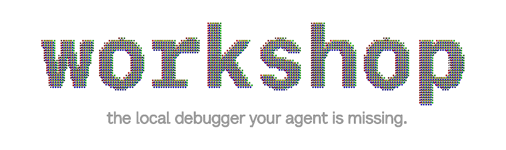

<p align="center">
  
</p>

# Raindrop Workshop

**The local debugger your agent is missing.** Watch your agent think locally,
the moment it happens: every token, every tool call, every decision.

Give Claude Code the power to read your traces, write evals against your
codebase, and fix what's broken.

## Install

```bash
curl -fsSL https://raindrop.sh/install | bash
```

## Build from source

```bash
git clone https://github.com/raindrop-ai/workshop.git
cd workshop
bun install
bun run dev
```

`bun run dev` starts the local Workshop daemon and Vite UI. Open
`http://localhost:5899` after it starts.

## Instrument your agent

Open your coding agent of choice in your repository and run:

```text
/instrument-agent
```

This will instrument your agent with Raindrop tracing and open Workshop in your browser.

That's it. Traces stream into the UI the moment your agent runs.

## What it does

- **Live streamed traces.** Every token, tool call, and span streams into
  Workshop as it happens. No polling, no refreshing.
- **Observer mode.** Run a second local OpenCode process as an LLM-as-judge
  that watches active traces, reads the Workshop SQLite database, and writes
  corrective steering events back into the UI.
- **Coding-agent integration.** Claude Code reads your traces, writes evals
  against your codebase, and fixes what's broken.
- **Self-healing eval loop.** Claude writes the eval, runs your agent, sees the
  failure, fixes the code, and re-runs — until every assertion passes.
- **Local replay.** `/setup-agent-replay` scaffolds an HTTP endpoint that replays a
  production trace against your real agent code.

## Observe and steer agents

Workshop includes an OpenCode observer example that runs beside the main UI:

```bash
cd examples/opencode-observer-agent
bun install
bun run dev
```

The observer watches `opencode_session` runs, launches `openai/gpt-5.5-pro`
judge passes when new agent activity appears, queries
`~/.raindrop/raindrop_workshop.db` with SQLite, and decides whether the active
agent or subagent needs corrective steering.

Observer traces are hidden from the main Runs list. Open a run and use:

- **Observer** for high-signal corrective actions only.
- **Observer Debug** for compact observer inputs, outputs, and tool calls.

The nudge/control bridge can be mocked locally; steering decisions are written
to `POST /api/steering/events` so they show up in Workshop.

## Compatible with everything

- **Languages:** TypeScript, Python, Go, Rust
- **SDKs:** Vercel AI SDK, OpenAI Agents SDK, Anthropic SDK, Claude Agent SDK,
  LangChain, LangGraph, CrewAI, Mastra, Pydantic AI, DSPy, Google ADK, Strands,
  Agno, Deep Agents
- **Providers:** AWS Bedrock, Azure OpenAI, Vertex AI
- **Coding agents:** Claude Code, Codex, Devin, Cursor, OpenCode

## Configuration

| Env var | Purpose | Default |
| --- | --- | --- |
| `RAINDROP_WORKSHOP_PORT` | HTTP + WS port | `5899` |
| `RAINDROP_WORKSHOP_DB_PATH` | SQLite database file | `~/.raindrop/raindrop_workshop.db` |
| `RAINDROP_LOCAL_DEBUGGER` | SDK-side: where to mirror traces | unset |

## CLI

```bash
raindrop workshop          # start and open UI
raindrop workshop setup    # write .env, then start and open
raindrop workshop status   # check health
raindrop workshop reset    # delete local DB after confirmation
raindrop update            # update the binary
```

## License

MIT.
