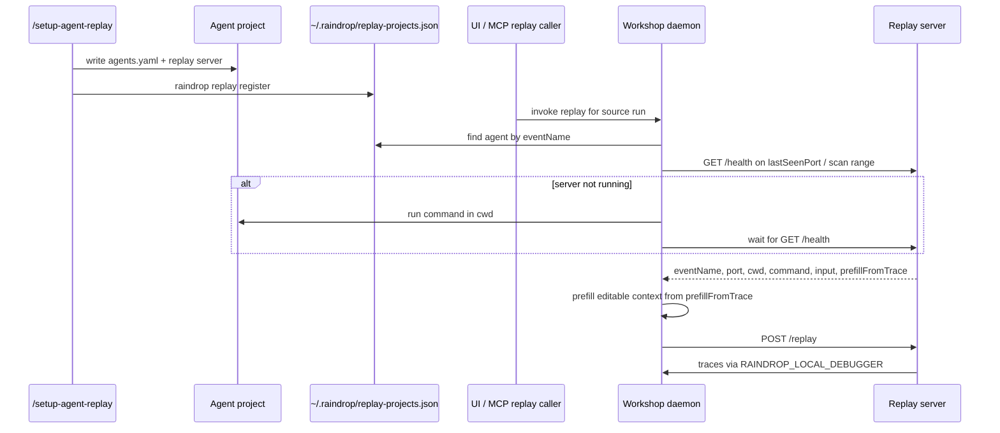

# Replay System Plan

Replay lets Workshop re-run an agent from a trace using the agent's real local code and tools.

## Simple Version

1. `/setup-agent-replay` sets up a project once.
2. The project commits `.raindrop/agents.yaml`.
3. Workshop keeps a local registry so it can find that project later.
4. Replay can be invoked from the UI or MCP.
5. Workshop starts the replay server when the user clicks Replay.
6. Workshop sends the replay request to the replay server.

## Diagram




## Project Config

`.raindrop/agents.yaml` is committed with the agent project.

```yaml
triage-agent-dev:
  command: pnpm replay-server
  cwd: apps/dawn

  input:
    orgPublicId: string
    orgId: number
    convoId: string
    source: string

  prefillFromTrace:
    orgPublicId: properties.orgPublicId
    orgId: properties.orgId
    convoId: ai.telemetry.metadata.raindrop.convoId
    source: properties.source

  models: # not tested right now, should be added to skill
    - claude-sonnet-4-20250514
    - gpt-4.1
```

`input` is the context shape the agent needs. `prefillFromTrace` tells Workshop how to prefill those fields from a trace. The user can edit the prefilled context before replay.

## Local Registry

Workshop needs a local registry because the daemon cannot know about every cloned repo on disk.

`raindrop replay register` stores enough information to start replay later:

```json
{
  "/Users/me/acme-agent": {
    "configPath": "/Users/me/acme-agent/.raindrop/agents.yaml",
    "agents": {
      "triage-agent-dev": {
        "cwd": "/Users/me/acme-agent",
        "command": "pnpm replay-server",
        "lastSeenPort": 61020
      }
    }
  }
}
```

The registry is populated by:

- `/setup-agent-replay` after setup.
- `raindrop replay register` from the project root.
- `raindrop workshop` opportunistically, if the active workspace has `.raindrop/agents.yaml`.
- `GET /health` results from already-running replay servers.

## Replay Server Contract

The skill generates a small HTTP server. Its port is hardcoded from `61020-61044`.

```typescript
const PORT = 61020;
```

### `GET /health`

Workshop uses this for discovery and schema.

```typescript
interface HealthResponse {
  ok: true;
  eventName: string;
  port: number;
  cwd: string;
  command: string;
  input: Record<string, string>;
  prefillFromTrace: Record<string, string>;
  models?: string[];
}
```

Example:

```json
{
  "ok": true,
  "eventName": "triage-agent-dev",
  "port": 61020,
  "cwd": "/Users/me/acme-agent", // i think it might not be passing the OTHER cwd (aka project level) in health rn 
  "command": "pnpm replay-server",
  "input": {
    "orgPublicId": "string",
    "orgId": "number"
  },
  "prefillFromTrace": {
    "orgPublicId": "properties.orgPublicId",
    "orgId": "properties.orgId"
  },
  "models": ["claude-sonnet-4-20250514", "gpt-4.1"]
}
```

Workshop stores `eventName`, `port`, `cwd`, `command`, `input`, `prefillFromTrace`, and `models` from health responses. `port` is stored as the last seen port, so Workshop can try it first before scanning the full range.

### `POST /replay`

Workshop sends:

```typescript
interface ReplayRequest {
  replayRunId: string;
  sourceRunId?: string;
  messages: Message[];
  systemPrompt?: string;
  userMessage?: string;
  model?: string;
  context: Record<string, unknown>;
}
```

The server returns immediately:

```json
{ "replayId": "abc123" }
```

Then it runs the agent asynchronously with local tracing enabled:

```typescript
process.env.RAINDROP_LOCAL_DEBUGGER = "http://localhost:5899/v1/";
```

For trace stitching, the generated replay server must pass `replayRunId` through the SDK's supported metadata surface:

1. Prefer `eventId: replayRunId`. This is supported by the JS AI SDK helper and Claude Agent SDK metadata, and lets Workshop merge the placeholder replay row with the real OTLP trace by event id.
2. If an SDK cannot set `eventId`, set a property named `replayRunId` instead.


Language-specific mapping:


| SDK                 | Preferred stitch field                                                                    |
| ------------------- | ----------------------------------------------------------------------------------------- |
| JS AI SDK           | `eventMetadata({ eventId: replayRunId, ... })`                                            |
| JS Claude Agent SDK | `eventMetadata({ eventId: replayRunId, ... })`                                            |
| Python              | `begin(event_id=replayRunId, ...)` / `Interaction(event_id=replayRunId, ...)`             |
| Go                  | `SpanOptions{EventID: replayRunId}` or an interaction started with that event id          |
| Rust                | `SpanOptions { event_id: replayRunId, ... }` or an interaction started with that event id |


All of these also support properties, but properties are the fallback. Event id is the primary merge key.

## Message Format

Workshop sends messages as AI SDK-style JSON. Generated replay servers can convert this if the agent uses another SDK.

```typescript
interface Message {
  role: "system" | "user" | "assistant" | "tool";
  content: string | ContentPart[];
  toolCalls?: ToolCall[];
  toolCallId?: string;
}

interface ContentPart {
  type: "text" | "image";
  text?: string;
  image?: string;
}

interface ToolCall {
  id: string;
  name: string;
  arguments: Record<string, unknown>;
}
```

## Workshop Behavior

Workshop runs on `localhost:5899`.

Replay servers use `61020-61044`. Workshop scans these ports every 5 seconds while the UI is open.

MCP does not expose a separate "register/start replay agent" tool. If a coding agent invokes replay through MCP, that request uses the same daemon path as the UI: check health, scan ports, start the stored command if needed, then send the replay request.

When Replay is clicked:

1. Workshop looks for the trace event name in its registry.
2. Workshop checks the last seen port first, then scans `61020-61044`.
3. If no healthy server is running, Workshop starts the stored `command` in the stored `cwd`.
4. Workshop waits for `GET /health`.
5. Workshop extracts context using `prefillFromTrace`.
6. Workshop lets the user edit the prefilled context.
7. Workshop sends `POST /replay`.

When MCP `replay_run` is invoked, it follows the same backend path as the UI replay action. There is no separate MCP tool for registering or starting replay servers.

If replay cannot find a registered or healthy local agent endpoint, Workshop returns a setup-required error that tells the coding agent to run `/setup-agent-replay` in the agent repo.

## `/setup-agent-replay`

The skill should:

1. Check for existing `.raindrop/agents.yaml`.
2. If it exists, ask whether to start/register the existing setup or add a new agent.
3. Find the agent entry point and confirm it is instrumented.
4. Infer `input` and `prefillFromTrace`.
5. Generate the replay server.
6. Pick an unused port in `61020-61044` and hardcode it.
7. Write `.raindrop/agents.yaml`.
8. Add a `replay-server` script or equivalent command.
9. Optionally add a combined dev command.
10. Start the replay server once and verify `/health`.
11. Run `raindrop replay register` and verify success.

Registration should confirm:

```text
Registered replay project:
  path: /Users/me/acme-agent
  config: /Users/me/acme-agent/.raindrop/agents.yaml
  agents:
    - eventName: triage-agent-dev
      cwd: /Users/me/acme-agent
      command: pnpm replay-server
      lastSeenPort: 61020
```

If registration fails, the skill should stop and show the error.

## End-to-End Test Plan

The goal is to prove the whole loop works without a user manually starting a replay server.

### 1. CLI And Registry Tests

Automated tests should cover:

- `raindrop replay register` from a project root with `.raindrop/agents.yaml`.
- Registry writes to `~/.raindrop/replay-projects.json`.
- Multiple agents in one project.
- Re-running register updates existing entries without duplicating them.
- `raindrop workshop` opportunistically registers the active workspace when `.raindrop/agents.yaml` exists.
- Missing yaml, invalid yaml, missing command, and duplicate event names produce clear errors.

Use a temporary `HOME` in tests so the real `~/.raindrop` is never touched.

### 2. Replay Server Fixture

Create a small fixture project, probably TypeScript first:

```text
fixtures/replay-agent-ts/
  .raindrop/agents.yaml
  package.json
  scripts/replay-server.ts
```

The fixture server should:

- Listen on a fixed port in `61020-61044`.
- Return `eventName`, `port`, `cwd`, `command`, `input`, `prefillFromTrace`, and `models` from `/health`.
- Accept `POST /replay`.
- Emit a simple Raindrop trace to Workshop using `RAINDROP_LOCAL_DEBUGGER`.
- Set SDK metadata `eventId` to the replay request's `replayRunId`, or set `properties.replayRunId` if that SDK cannot set event ids.

This fixture becomes the main automated E2E target.

### 3. Daemon Startup E2E

Run Workshop with an isolated temp environment:

1. Build or run the local CLI.
2. Start Workshop on a test port with a temp DB and temp `HOME`.
3. Register the fixture project.
4. Ensure no replay server is running.
5. Trigger replay through Workshop's API.
6. Assert Workshop starts the fixture command in the fixture `cwd`.
7. Assert Workshop sees `/health` and stores `lastSeenPort`.
8. Assert Workshop sends `POST /replay`.
9. Assert replay traces land in Workshop and are associated with the replay run.

This is the core "click Replay and it just works" test.

### 4. MCP Replay E2E

Use the same fixture to invoke MCP `replay_run` for a source run:

- Assert there is no separate MCP register/start tool.
- Assert `replay_run` triggers the same health check, port scan, command startup, and `/health` wait as UI replay.
- Assert the replay request reaches the fixture server.
- Assert the MCP result includes the replay run id and replay events.

### 5. UI E2E

Add a browser test that uses the same fixture:

- Open Workshop.
- Load or seed a trace with `eventName: triage-agent-dev`.
- Verify local replay is available.
- Verify context is prefilled from `prefillFromTrace`.
- Edit one context value.
- Click Replay.
- Verify the replay run appears and the original/replay comparison works.

### 6. Skill E2E

Test `/setup-agent-replay` against fixture repos:

- No existing `.raindrop/agents.yaml`: generates server, yaml, script, registers project.
- Existing `.raindrop/agents.yaml`: asks whether to start/register existing setup or add a new agent.
- Existing app dev command: adds or suggests a combined dev command.
- Registration failure: stops and reports the error.

The fully automated part can be a golden-file test for generated files. A manual smoke test should still run the skill through Claude Code/Cursor until the skill interface itself is easy to automate.

### 7. Cross-Language Smoke

After the TypeScript fixture works, add minimal Python, Go, and Rust fixtures:

- Each fixture only needs `/health` and a simple `/replay`.
- Each uses that language's Raindrop SDK where possible.
- Each proves the command in `.raindrop/agents.yaml` can be started by Workshop.

Do not make every language test hit a real LLM. The point is process startup, schema, replay request handling, and trace ingestion.

## Fast Reinstall Loop

For normal skill iteration:

```bash
raindrop sync
```

`raindrop sync` reads `~/.raindrop/install-registry.json` and refreshes tracked skills plus MCP entries. Use this after editing skill files.

For hot-reload Workshop development:

```bash
bun run dev
```

For branch hygiene before a full E2E run:

```bash
git fetch origin main
git rebase origin/main
```

